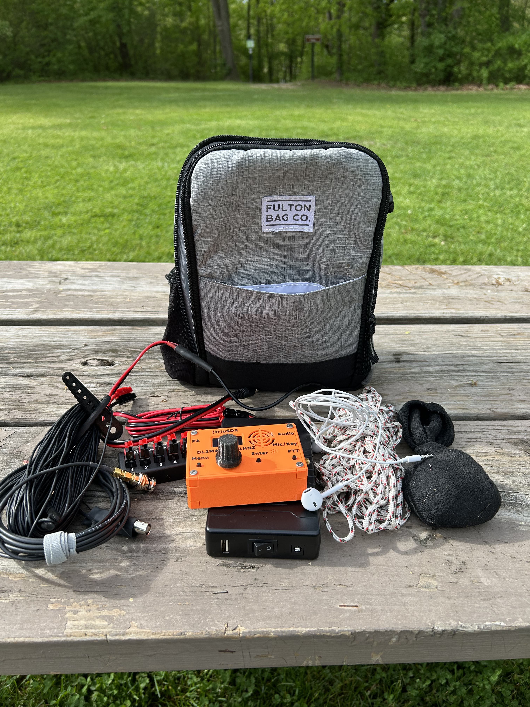

Yesterday I did my first POTA of the year. It was also my first time taking my TruSDX out in the field and was really impressed with what I could do with 5 Watts! The activation was all phone, but am looking forward to getting my CW recall up to snuff to see what I can do with the .5 watt options. It would be real cool to just go out with the unit, antenna, and provide power via my phone and make some contacts. 

<!--more-->

## Activation map



## Logbook


